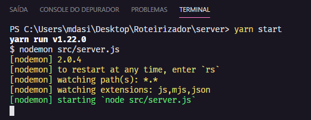
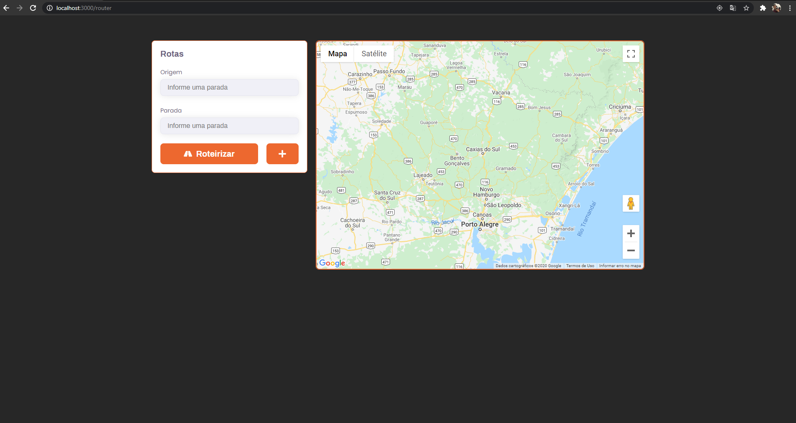
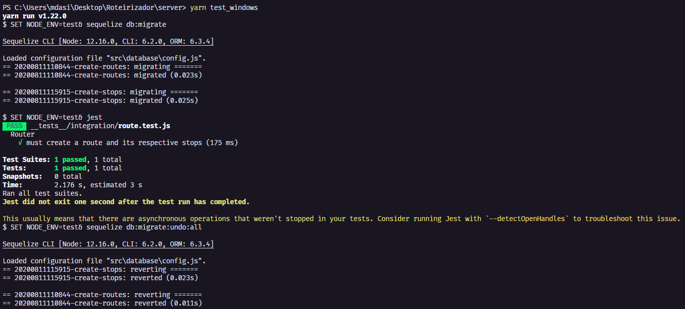

# Desafio - Roteirizador

Projeto desenvolvido a partir do desafio proposto neste [repositório](https://github.com/Attivilog/DesafioRoteirizador).

A aplicação é uma solução que retorna ao usuário informações de tempo e distância de uma rota com dois ou mais pontos de parada, ilustrando no mapa os pontos e a rota informados pelo usuário.

Demonstração do projeto em execução:


## Tecnologias Utilizadas

* [ReactJs](https://reactjs.org/) - Front-End
* [Node.js](https://nodejs.org/en/) - Back-End
* [PostgreSQL](https://www.postgresql.org/) - Database


## Autores

**Mateus Catel** | [Contato](mailto:contato@catel.dev?subject=GitHub%20|%20Desafio%20-%20Roteirizador) | [LinkedIn](https://www.linkedin.com/in/mateus-catel-258338148/)


# Introdução

Essas instruções fornecerão uma cópia do projeto instalado e funcionando em sua máquina local para fins de desenvolvimento e teste.


# Pré-requisitos

O que você será necessário para rodar o projeto.


## Node.js

Linux:

~~~
sudo apt install nodejs
~~~

Windows (usando o Chocolatey):
```
cinst nodejs
```

Outros exemplos podem ser encontrados [aqui](https://nodejs.org/en/download/package-manager/), ou baixe a versão [executável](https://nodejs.org/en/download/).


## Yarn

```
npm install -g yarn
```
Mais informações [aqui](https://yarnpkg.com/getting-started).


## Banco de dados PostgreSQL

O download e a instalação do PostgreSQL estão disponíveis [aqui](https://www.postgresql.org/download/) para variados sistemas operacionais.
>Também pode ser utilizado um banco de dados em arquivo (Ex: SQLite).


# Instalação do Projeto

Faça o download do projeto:

```
git clone https://github.com/mcatel/Roteirizador
```


## Servidor

Instalação das dependências:
```
cd server
yarn install
```

## Configuração do banco de dados:
Crie os arquivos **.env** e **.env.test** na raiz do projeto utilizando o exemplo abaixo. Será necessário modificar os parâmetros para a conexão com o seu banco de dados.

Exemplo:
```
PORT=3333
DB_DIALECT=postgres
DB_HOST=localhost
DB_USER=postgres
DB_PASS=postgres
DB_NAME=router
```
>Para o arquivo **.env.test** utilize um DB_NAME diferente do utilizado no arquivo **.env**, pois esse será seu banco de dados de teste.

>O atributo DB_STORAGE serve para utilização de bancos de dados em arquivos (Ex: SQLite).


## Criação do banco de dados:
```
yarn sequelize db:create
```

## Criação/Atualização das tabelas:
```
yarn sequelize db:migrate
```

## Iniciando o servidor de desenvolvimento:
```
yarn dev
```

Após isso, a [API](http://localhost:3333) estará rodando na porta 3333.




## Interface Web

Instalação de dependências:
```
cd web
yarn install
```

Iniciando a aplicação:
```
yarn start
```

Após isso, a [aplicação](http://localhost:3000) estará rodando na porta 3000.





## Maps
Para poder visualizar o mapa completo e utilizar o preenchimento automático nos campos de rota, é necessário obter uma **API_KEY** do Google Maps. Mais informações [aqui](https://cloud.google.com/docs/authentication/api-keys).

Após isso, deve ser criado um arquivo **.env** na raíz do projeto, seguindo o exemplo **(.env.example)**

## Configuração da interface web:
Crie o arquivo **.env** na raiz do projeto utilizando o exemplo abaixo. Será necessário modificar os parâmetros para a conexão com o seu servidor.

Exemplo:
```
REACT_APP_BACKEND_URL_PROD='https://roteirizador.example.com/'
REACT_APP_BACKEND_URL_LOCAL='http://localhost:3333'
REACT_APP_GOOGLE_MAPS_API_KEY='SUA_API_KEY'
```

> Além disso, para poder visualizar o mapa completo e utilizar o preenchimento automático nos campos de rota, é necessário obter uma **API_KEY** do Google Maps. Mais informações [aqui](https://cloud.google.com/docs/authentication/api-keys).


# Testes

Para execução dos testes, primeiramente será necessário criar um novo banco de dados.

Linux:

```
yarn create_db_test
```
Windows:
```
yarn create_db_test_windows
```
## Executando os testes

Linux:
```
yarn test
```

Windows:
```
yarn test_windows
```

